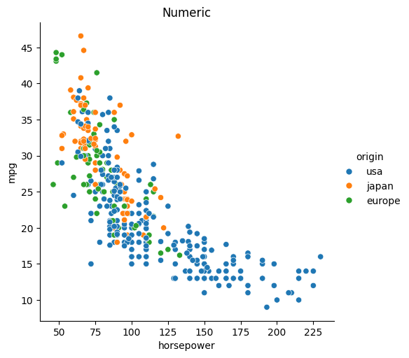
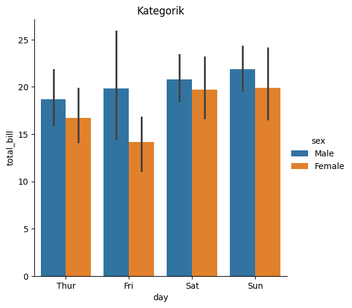

# Comparing Numeric and Categorical Variables in Python

This project shows how to visualize and compare numeric and categorical variables using simple datasets and plots. The goal is to understand how different kinds of variables behave — especially when we want to spot relationships or differences quickly.

## What tools are used?

- **Python 3**
- **Seaborn**: For statistical visualizations like relational and categorical plots.
- **Matplotlib**: (Optional backend used by Seaborn)

## 1. Numeric Variable Comparison

In the first part, we used the built-in `mpg` dataset (miles per gallon) which includes car-related features like horsepower, origin, and fuel consumption.

We used a **relational plot** to compare `horsepower` (numeric) with `mpg` (also numeric), while using `origin` (categorical) as a color-based grouping.

The plot helps answer: 
How does engine power affect fuel efficiency? 
Do cars from different regions show different patterns?

Here’s the result:


As you can see, higher horsepower tends to result in lower mpg. Also, cars from different origins follow slightly different patterns.

## 2. Categorical Variable Comparison

In the second part, we loaded the classic `tips` dataset (restaurant bills and tips). The idea here was to compare how much people spend depending on:

- Which **day of the week** they visit
- Their **gender** (`sex` column)

We used a **categorical bar chart** to show average total bills.

The goal is to answer: 
Do some days have higher spending overall? 
Is there a visible difference between male and female customers?

Here’s the output:




This kind of chart is helpful to see group-based differences without needing to compute statistics manually.

## Why these plots are useful

- If you're working with numeric values, **relational plots** are good to check trends, relationships, or clusters.
- For group comparisons (like categories), **categorical bar charts** quickly highlight differences across groups.

These kinds of visualizations are especially useful at the start of any data project. They help you see what’s happening in the data — before writing complex models or transformations.

## Folder Structure

```
project/
│
├── comparing.ipynb
├── README.md
└── images/
    ├── catplot.png
    └── relplot.png
```

Make sure to place your generated images inside the `images/` folder to match the relative paths used in this README.

## How to Run

1. Install dependencies:
```bash
pip install seaborn matplotlib
```

2. Run the `comparing_variables.ipynb` notebook.
3. The images will be saved manually or using `plt.savefig()` if added.
4. Update this README if you rename image files or change paths.

---

This is a simple but very practical way to visually compare variables — useful for both EDA (exploratory data analysis) and reporting.

