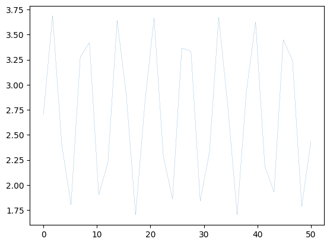

----
| # | Project Title | Description | Tools |
|--:|----------------------------|---------------------------------------------------------|------------------------------|
| 1 | Compare Categorical vs Numeric | Visual comparison of variable types using `relplot` & `catplot` | `Seaborn`, `Pandas` |
| 2 | Monthly Tractor Sales         | Time series creation, cleaning, and plotting from raw CSV data | `Pandas`, `Matplotlib` |
| 3 | Moving Average on GDP         | Smoothing yearly GDP values using rolling averages | `Pandas`, `Matplotlib` |
| 4 | Additive Decomposition        | Breaking down time series into trend, seasonality, and noise | `Statsmodels`, `Pandas` |
| 5 | Matplotlib Plotting Toolkit   | Line plots, histograms, 2D/3D plots, and basic animations | `Matplotlib`, `NumPy` |

---

----------
<table>
  <tr>
    <td></td>
    <td></td>
  </tr>
  <tr>
    <td></td>
    <td></td>
  </tr>
</table>
---------
<table>
  <tr>
    <td></td> 
    <td></td>
  </tr>
  <tr>
    <td></td>
    <td></td>
  </tr>
</table>

--------
<table>
  <tr>
    <td></td>
  </tr>
  <tr>
    <td></td>
  </tr>
</table>  
</table>
    <tr>
    <td></td>
    <td></td>
  </tr>
  <tr>
    <td></td>
    <td></td>
  </tr>
</table>
---------

------------

# Time Series and Data Visualization Projects

Welcome to this collection of small yet practical data projects in Python, mainly focusing on **time series**, **data visualization**, and **exploratory analysis**. Each mini-project is isolated but follows a common goal — to build intuition about real-world datasets and show how Python tools can be used effectively.

All projects are written in **Jupyter Notebooks** and rely on familiar, production-grade libraries such as:

- `pandas` (data handling)
- `matplotlib` & `seaborn` (visualization)
- `statsmodels` (time series decomposition)
- `numpy` (numerical utilities)

---

## Projects Overview

### 1. Compare Categorical vs. Numeric Variables

We compare numerical and categorical variables using `relplot()` and `catplot()` from **Seaborn**.

- Categorical example: `day`, `sex` vs `total_bill` (barplot)
- Numeric example: `horsepower` vs `mpg` (scatter)

**Goal:** Show how variable types impact plot type and interpretability.

---

### 2. Monthly Tractor Sales — Time Series Conversion

A raw CSV file with dates in messy format is converted into a clean `datetime` format. Then the time series is visualized over ~12 years of monthly sales.

**Key steps:**

- Fixing and converting date strings 
- Offsetting artificial base years 
- Building a time index using `pd.date_range` 
- Plotting over time with `matplotlib`

---

### 3. Moving Average of GDP Over Time

We take historical GDP data and calculate the moving average (window size: 5 years) to smoothen out the signal.

**Outcome:**

- Clear visual of GDP trends over time
- Reduced volatility for better forecasting interpretation

**Tools used:** `rolling().mean()` from `pandas`

---

### 4. Additive Time Series Decomposition (Retail Turnover)

Using `seasonal_decompose` from **statsmodels**, we split a quarterly retail dataset into:

- **Trend** (long-term direction)
- **Seasonality** (quarterly pattern)
- **Residual** (unexplained error)

**Result:** Visualizing how real-world business data behaves and how each component contributes.

---

### 5. Matplotlib Plotting Toolkit (Lines, Histograms, 2D, 3D, Animations)

This project explores the broad capabilities of `matplotlib`, including:

- Line plots with custom styles and legends
- Histogram comparisons using bins and density
- 2D contour plots for surface functions
- 3D surface plots with rotation and color maps
- Animated GIF generation via `FuncAnimation`

**Highlight:** Great for showcasing basic to advanced plotting with minimal code.

---

## Why This Repo?

- Helps you **practice end-to-end thinking** from raw CSV to insight
- Strengthens **time series skills** with real-world datasets
- Builds confidence in **plotting and interpretation**
- All projects are lightweight and beginner-friendly yet not trivial

