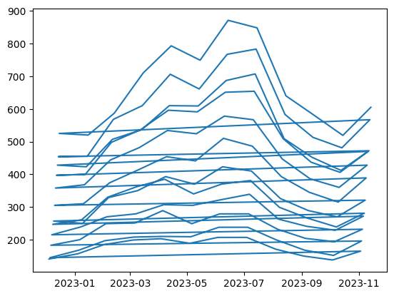
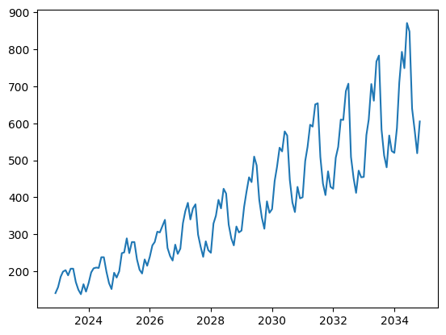

# Tractor Sales: Identifying Seasonality Patterns with Python

This short project focuses on identifying seasonality in tractor sales data. We work with monthly sales data and try to observe if there is any repeating pattern or trend over time — something you often need to check before forecasting.

## Tools Used

- **Pandas** — for data loading and time series manipulation  
- **Matplotlib** — for simple time-based plotting

## What the data looks like

The dataset contains two columns:

- `Month-Year`: The date of the sales, but initially in a non-standard format.
- `Number of Tractor Sold`: The number of tractors sold that month.

Sample:

```
Month-Year   | Number of Tractor Sold
-------------|-------------------------
03.01.1900   | 141
03.02.1900   | 157
03.03.1900   | 185
...
```

Of course, the dates like "03.01.1900" are not real — they’re placeholders. So the first step was to convert these into proper dates and shift them forward to make the data feel current.

We added roughly 80 years to all the dates using:

```python
sales_data["Month-Year"] = pd.to_datetime(sales_data["Month-Year"], format="%d.%m.%Y")  
sales_data["Month-Year"] = sales_data["Month-Year"] + pd.Timedelta(days=365*80)
```

Now, the dataset starts in December 2022 and runs monthly for 144 entries (12 years). That’s enough to visually inspect seasonal behavior.

---

## Plotting the sales over time

We used `matplotlib` to draw a simple line plot:

```python
plt.plot(sales_data["Month-Year"], sales_data["Number of Tractor Sold"])
plt.title("Tractor Sales Over Time")
plt.xlabel("Date")
plt.ylabel("Tractors Sold")
plt.show()
```





This basic line graph already shows some wave-like behavior — clear ups and downs over each year, indicating seasonality.

To double-check the time scale, we also built a synthetic date range using `pd.date_range()` and plotted the data again, just to confirm alignment.

---

## Why it matters

Seasonality detection is a common first step before applying any forecasting model. If the sales have strong yearly cycles, then models like ARIMA, Holt-Winters, or Prophet can benefit from this knowledge. This project doesn’t go that far, but lays the foundation.

---

## Folder Structure

```
Seasonality_tractor_Project/
│
├── tractor_sales.ipynb
├── README.md
└── images/
    └── sales_plot.png
    └── sales_plot.png
```

---


This is a good beginner-friendly example of working with time series data, cleaning up messy dates, and making basic but useful visualizations.


