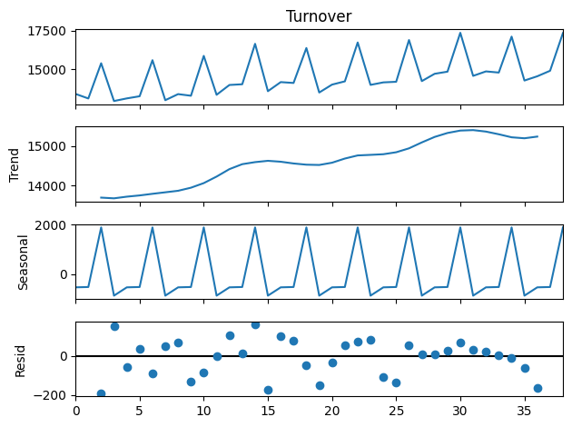
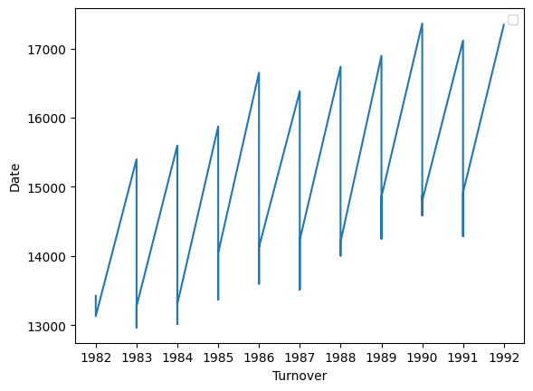

# Retail Turnover Analysis using Additive Decomposition

This project focuses on understanding **retail sales turnover** by breaking it into separate components: long-term trend, seasonal patterns, and irregular movements. 
We use a technique called **additive decomposition**, which helps us explore how these three forces affect the total sales numbers.

---

## Why We Use Decomposition

In real-world business data — especially sales or revenue — numbers often go up and down due to seasons, holidays, or general trends. 
However, these patterns can mix together, making it hard to see what’s really happening.

By using decomposition, we can:
- Spot the actual **growth trend** in the business
- Understand **seasonal cycles** (like sales spikes in December)
- Catch **unusual activity** that doesn't follow the pattern

This helps businesses make smarter decisions.

---

## Dataset Overview

We analyze **quarterly retail turnover data** from 1982 to 1992. 
Each row in the dataset includes:
- A date (with the year and quarter)
- The total turnover amount for that quarter

This is real-world style time series data — the kind of data that appears in retail reports or economic summaries.

---

## Approach

We apply an **additive model** where the data is split into:

```
Total Turnover = Trend + Seasonality + Residual
```

- **Trend**: Shows if turnover is growing, shrinking, or stable over time
- **Seasonality**: Repeats in a cycle — like higher sales in Q4 every year
- **Residual**: The leftover noise — unpredictable events or anomalies

---

## How the Data is Prepared

To do decomposition, we first:
- Format the year column as proper date-time values
- Create a timeline with equal gaps (quarterly in this case)


---

## What We Discover

The decomposition gives us three separate plots:

1. **Trend** 
   - A smoother line that shows whether turnover is going up or down long-term.
   - For example, a steady upward trend may show that the retail sector is growing year after year.

2. **Seasonality** 
   - A repeating curve that shows similar ups and downs at the same time every year.
   - You might see sales go up in Q4 due to holidays or promotions.

3. **Residual** 
   - Random changes not explained by trend or seasonality.
   - These could be unexpected economic events, policy changes, or outliers.

---


---
## Project Structure

```
decomposition_additive_model/
│
├── decomposition_additive_model.ipynb
├── README.MD
├── data
    ├── RetailTurnover.csv
└── images/
    └── turnover.png
    └── turnover2.png

---

## Tools Used

- **Pandas** for reading and formatting time series data
- **Matplotlib** for plotting the data and results
- **Statsmodels** for applying additive decomposition

These are all popular Python libraries for data analysis and time series work.

---


