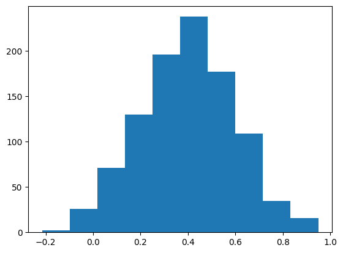
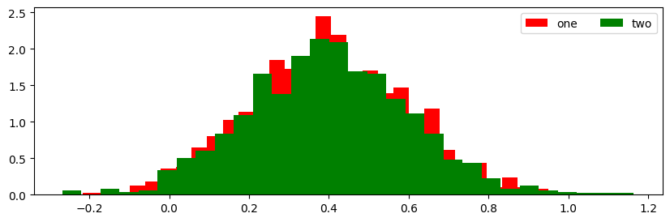
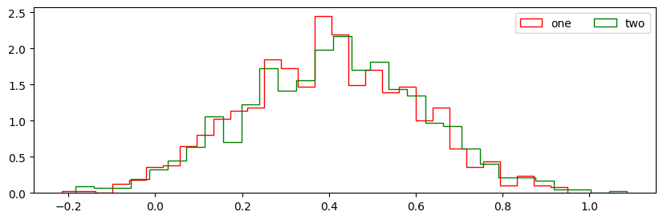
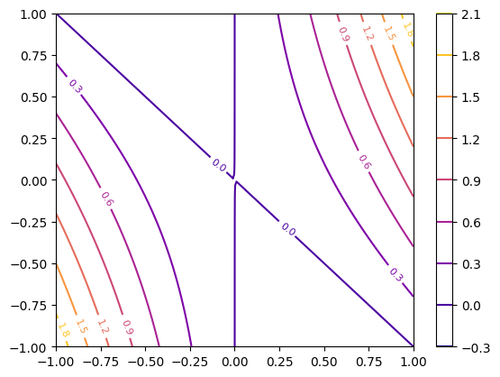

<table>
  <tr>
    <td></td>
    <td></td> 
    <td></td>
    <td></td>
  </tr>
  <tr>
    <td></td>
    <td></td>
    <td></td>
    <td></td>
  </tr>
</table>

---

# Matplotlib Plotting Project  
**Data visualization using line plots, histograms, 2D contours, and 3D surfaces**

This project demonstrates different ways of visualizing numerical data using **Matplotlib**, one of Python's most powerful plotting libraries. The aim is to understand how simple arrays and distributions can be represented graphically — both for analysis and for presentation.

---

## Tools Used

| Library      | Purpose                                 |
|--------------|------------------------------------------|
| **Matplotlib** | Main plotting and visualization         |
| **NumPy**      | Numerical calculations and random data  |
| **mpl_toolkits.mplot3d** | 3D plotting module from Matplotlib |
| **Matplotlib Animation** | Creating animated plots (e.g. rotating 3D surfaces) |

---

##  What We Visualized

### 1. **Line Plots**

- We started by generating a sine wave with some added randomness.
- Different visual styles were applied:
  - Dashed lines
  - Point markers
  - Custom line widths and marker sizes
- We learned how to:
  - Add axis labels
  - Customize figure size
  - Add legends in the right position

These types of plots are great for showing how values change over time or across a range.

---

### 2. **Histograms**

- We generated random values with a normal distribution.
- Used `bins` to control the number of bars and `density=True` to normalize the histogram.
- Compared multiple datasets by overlaying them:
  - Filled style (`default`)
  - Step outline style (`histtype="step"`)

This helps compare distributions (e.g., noise, performance, measurements) in a clear way.

---

### 3. **Multiple Histograms in Subplots**

- Created four different random distributions (omega1–omega4)
- Displayed them on a `2x2` subplot grid with different colors and labels
- Used `plt.text()` to annotate each subplot for clarity

This is useful when you want to compare multiple scenarios side-by-side.

---

### 4. **2D Contour Plots**

- Defined a mathematical function `z = x² + xy` over a meshgrid
- Plotted both:
  - **Filled contours** (heatmap-style)
  - **Line contours** with labeled values and color bar

This is typically used in optimization, simulations, or showing physical landscapes.

---

### 5. **3D Surface Plot**

- Used the same `(x, y, z)` grid to build a **3D surface**
- Colored using a color map (e.g., *plasma*, *coolwarm*)
- Useful for visualizing surfaces or cost functions in machine learning

---

### 6. **Animated 3D Plot (GIF)**

- Rotated the 3D surface slowly using a custom `animate()` function
- Created 50 frames and exported it as a `.gif` file
- Shows how camera angles affect our view of 3D plots

This is very effective when explaining 3D geometry or making a presentation more dynamic.

---

## When to Use These Plots

| Plot Type       | Use Case Example                                 |
|-----------------|--------------------------------------------------|
| **Line Plot**   | Tracking stock prices, weather changes, trends   |
| **Histogram**   | Analyzing distribution of sales, grades, returns |
| **Contour Plot**| Showing elevation, cost function levels          |
| **3D Surface**  | Modeling mathematical equations or simulations   |
| **Animation**   | Making presentations engaging or analyzing motion|

---

This project serves as a compact visual tour of what’s possible with **Matplotlib** — from simple line plots to animated 3D models. 
Such techniques are essential for data analysis, presentations, and scientific research.

